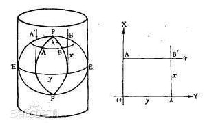
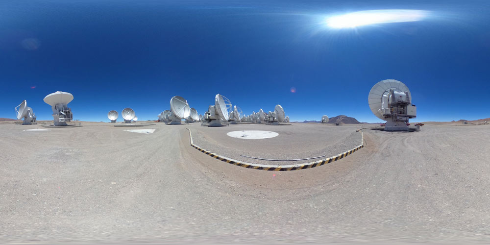
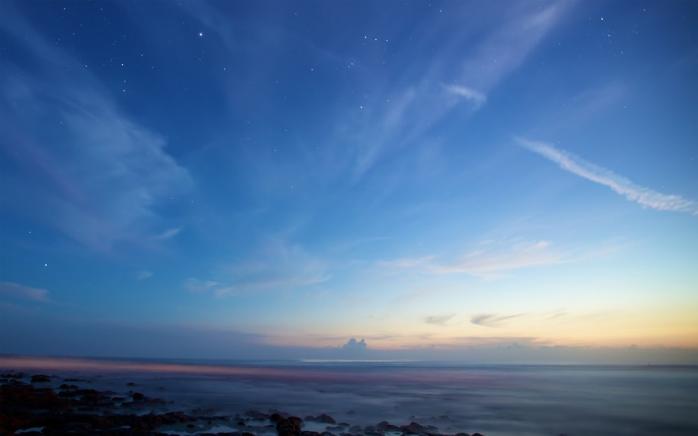
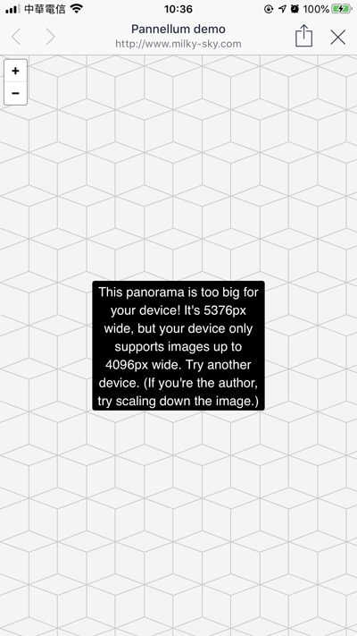
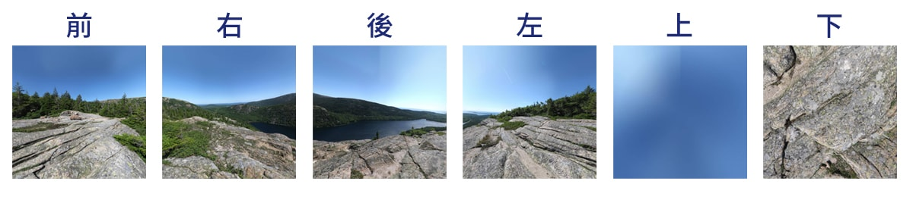
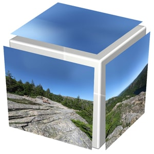

# Pannellum套件，簡單套用，打造360度環景效果！
_部分內容取自掘金，連結：https://juejin.im/post/5b62b985e51d455d947196fc_

*  [Pannellum套件 官方網站](https://pannellum.org/)  

## 一：簡單認識Pannellum支持的四種處理全景圖片模式：「equirectangular、partial、cubic、multi-resolution」
<div style="text-align:center; border:1px solid #cccccc; padding:20px; display:table; margin: 0 auto;">
   
   equirectangular圓柱投影<br>
   partial 局部圓柱體投影<br>
   cubic 立方體投影<br>
   multi-resolution 根據縮放的程度（改變Hfov）來顯示不同清晰度的照片
</div>

本篇選擇equirectangular圓柱投影及cubic立方體投影兩種模式來簡單紀錄與說明<br>

1. equirectangular圓柱投影：為最簡單的製作模式，是針對單張全景環景圖片的處理方式，如下圖：

   

   簡單來說就是把一個球體的表面使用圓柱體投影到圓柱體的側面上，這樣就能夠實現全方位的全景體驗，這也使得全景圖跟普通的"大圖"不一樣，全景圖還需要包含上下的圖像，也就是全景圖有“顶”和“底”的，如下圖：

   
   原圖為環景圖<br>
   

   如果是普通的圖，則會呈現如下圖<br>
   
   原圖為普通圖<br>
   

   優點：一張環景圖即可製作<br>
   缺點：如果環景圖的某一個區域出现了“壞點”、“黑洞”，或者圖像撕裂等问题，equirectangular的全景圖就需要重新合成一張新的全景圖，或者对照着圓柱體投影来修圖，過程較為麻烦<br>
   
   額外須注意：圖片寬度尺寸勿超過4000px，在手機版會無法載入顯示<br>
   

2. cubic立方體投影：針對拆分全景圖片的投影方式，即將整個投影空間看作一個立方體，具有前後左右上下6個面，分别将各個拆分全景圖片渲染在對應的各個面上，在感官上也能夠達到柱面投影的效果，如下圖：

   

   

   

   Pannellum傳入圖片的顺序為：前、右、後、左、上、下。

   優點：如果圖片出現黑點，只需要替换掉對應面上的圖片即可<br>
   小缺點：如果不按照顺序傳入相對應面的圖片就會出现錯位的情况

<br><br>
從上方的兩個模式可以發現到使用cubic和equirectangular的方式效果差不多，但cubic要求圖片的顺序、大小保證一致以及對各個圖片之間的重合度要求更高，使用起來更加複雜，那麼既然效果差不多為什麼還要使用這種方式呢？
1. 該方式有利於粗加工或未加工的圖片展示為全景圖片，因為cubic方式可以直接採用源圖片來進行投影拼接成全景圖，所以只要能夠在用相機拍攝圖片的时候固定好各個方向鏡頭的角度，拍攝得到的圖片只需要經過粗加工（例如裁切成正方形）就可以直接用来展示，免去了再將所有圖片合成为一张大的全景圖的過程。
2. cubic方式比equirectangular方式更加靈活，如果全景圖的某一个區域出现了“壞點”，“黑洞”，或者圖像撕裂等問題，equirectangular的全景圖就需要重新合成一張新的全景圖，或者對照圓柱體投影来修圖，過程麻烦，而對於cubic方式來說就只需要替换掉對應面上的圖片即可。
<br><br>

* * *

## 二：Pannellum架構簡略說明

以下範例說明採用較為簡單的「equirectangular圓柱投影」模式說明

快速應用方式及參數說明：
```html
   <!-- 載入以下css -->
   <link rel="stylesheet" href="css/pannellum.css"/>
   <link rel="stylesheet" href="css/style.css"/>
   <script src="https://code.jquery.com/jquery-latest.js"></script>
   
   <!-- 僅一行的html -->
   <div id="panorama"></div>

   <!-- 載入以下js -->
   <script src="js/pannellum.js"></script>
   <script>
         
         const config = {
            autoLoad: false,  //自動載入為true
            preview: "images/trapboveneinde_dvoxir4000.jpg", // preview: ↑↑指定在加載全景圖之前要顯示的預覽圖像的URL。
            compass: false, // 畫面右下角的指南針是否顯示
            // 默認参数
            default: {
               firstScene: "office",   // 第一個場景為辦公室
               sceneFadeDuration: 1000 // 場景過度的動畫時間
            },

            // 場景設定
            scenes: {
               
               // 場景1:辦公室office
               office: {
                  hfov: 180,  //要渲染的水平視場（以弧度為單位）
                  pitch: 0, //垂直
                  yaw: 0, //水平
                  type: "equirectangular", //圓柱投影模式，针对单张全景图片的处理方式
                  panorama: "images/trapboveneinde_dvoxir4000.jpg",
                  
                  // 場景上，出現的熱點(按鈕)設定
                  hotSpots: [
                     {
                        pitch: 4,
                        yaw: 21.8,
                        type: "scene",
                        text: "前往meetingroom",  //滑鼠滑入出現的文字，可隱藏
                        sceneId: "meetingroom"
                     },

                     // 測試
                     {
                        pitch: -20,   //垂直，越大越往上偏
                        yaw: -21.8,   //水平，越大越往右偏

                        //熱點類型，scene 場景切换熱點； info 顯示的訊息；URL 以熱點为鏈接，點擊後跳轉到其他頁面
                        type: "info",
                        text: "外部連結", //滑鼠滑入出現的文字，可隱藏
                        URL: "https://www.dc.com.tw/",  //另開視窗
                        cssClass:"textBox"  //★★★★ 動態生成文字class，可不加，主要是想針對此按鈕做css或是jq設定 ★★★★
                     }
                     ,
                     {
                        pitch: 40, //垂直，越大越往上偏
                        yaw: 50,   //水平，越大越往右偏
                        type: "info",
                        text: "滑鼠滑入show圖片",  //滑鼠滑入出現的文字，可隱藏此text參數
                        image:"images/test01.jpg"
                     }
                     ,
                     {
                        pitch: -40, //垂直，越大越往上偏
                        yaw: -50,   //水平，越大越往右偏
                        type: "info",
                        text: "我是LightBox",  //滑鼠滑入出現的文字，可隱藏此text參數
                        cssClass:"myLightBox"  //★★★★ 按鈕動態生成class ★★★★
                     }
                  ]
               },
               
               // 場景2:會議室meetingroom
               meetingroom: {
                  hfov: 180,  //要渲染的水平視場（以弧度為單位）
                  pitch: 0, //垂直
                  yaw: 90, //水平
                  type: "equirectangular", //圓柱投影模式，針對單張全景圖片的處理方式
                  panorama: "images/vergaderzaal_sq7baz4000.jpg",
                  hotSpots: [
                        {
                           pitch: 8, //垂直，越大越往上偏
                           yaw: -58,   //水平，越大越往右偏
                           type: "scene",
                           sceneId: "office"
                        }
                  ]
               },
            }
         };
         pannellum.viewer('panorama', config);
      </script>
```
*  [equirectangular圓柱投影_做成範例](http://www.milky-sky.com/brangista/360/)  

若想使用「cubic立方體投影」模式，則將script裡的「type: "equirectangular"」的程式碼修改為「type: "cubemap"」,
並加上圖片順序的程式碼，如下：

```html
   
   <script>
         const config = {
            autoLoad: false,  //自動載入為true
            preview: "images/trapboveneinde_dvoxir4000.jpg", // preview: ↑↑指定在加載全景圖之前要顯示的預覽圖像的URL。
            compass: false, // 畫面右下角的指南針是否顯示
            // 默認参数
            default: {
               firstScene: "office",   // 第一個場景為辦公室
               sceneFadeDuration: 1000 // 場景過度的動畫時間
            },

            // 場景設定
            scenes: {
               
               // 場景1:辦公室office
               office: {
                  hfov: 180,  //要渲染的水平視場（以弧度為單位）
                  pitch: 0, //垂直
                  yaw: 0, //水平
                  type: "cubemap", //立方体投影，針對原圖片使用(未使用廣角)
                     cubeMap: [
				         // ↓↓↓↓ 使用的各个面的图片必须为正方形且大小相等！且需要按照特定的顺序传入图片。↓↓↓
			        	   // 前
				         "http://www.milky-sky.com/brangista/pannellum-master/examples/examplepanocube0.jpg",
				         // 右
				         "http://www.milky-sky.com/brangista/pannellum-master/examples/examplepanocube1.jpg",
				         // 后
				         "http://www.milky-sky.com/brangista/pannellum-master/examples/examplepanocube2.jpg",
				         // 左
				         "http://www.milky-sky.com/brangista/pannellum-master/examples/examplepanocube3.jpg",
				         // 上
				         "http://www.milky-sky.com/brangista/pannellum-master/examples/examplepanocube4.jpg",
				         // 下
				         "http://www.milky-sky.com/brangista/pannellum-master/examples/examplepanocube5.jpg"
				      ],
                  
                  // 場景上，出現的熱點(按鈕)設定
                  hotSpots: [
                     {
                        pitch: 4,
                        yaw: 21.8,
                        type: "scene",
                        text: "前往meetingroom",  //滑鼠滑入出現的文字，可隱藏
                        sceneId: "meetingroom"
                     }
                  ]
               }
               
            }
         };
         pannellum.viewer('panorama', config);
      </script>
```
*  [cubic立方體投影_做成範例](http://www.milky-sky.com/brangista/360/cube.html)  

*  [更多API應用指南與說明](https://pannellum.org/documentation/examples/simple-example/)  


